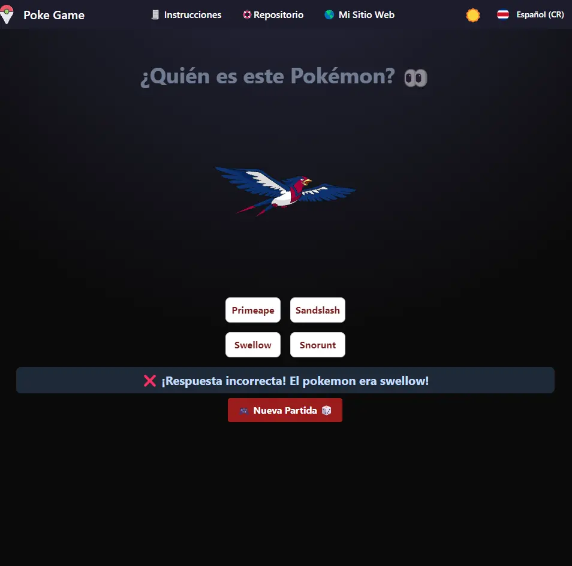
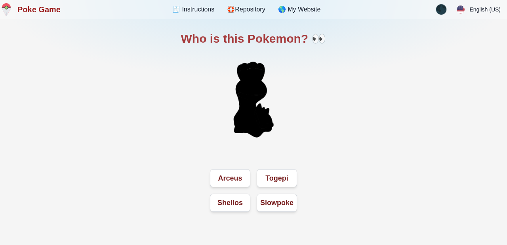
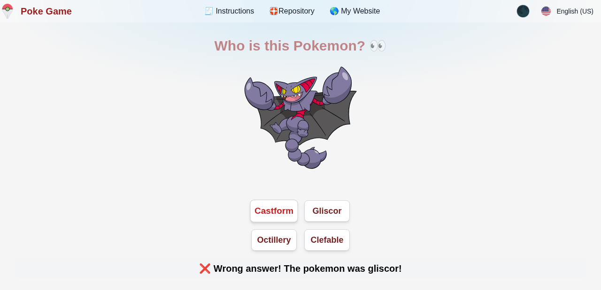
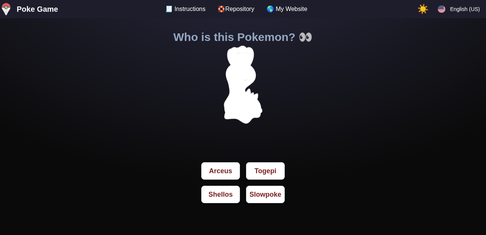

<div align="center">



# PokeQuiz Adventure Game

**"Who's that Pokémon?" — a quiz game where you guess the Pokémon from its silhouette.**

[](https://poke-quiz-adventure.netlify.app/)

    

</div>

## Screenshots

<table>
  <tr>
    <td width="50%"></td>
    <td width="50%"></td>
  </tr>
  <tr>
    <td align="center"><sub>Guess the Pokémon from its silhouette</sub></td>
    <td align="center"><sub>The answer is revealed after each pick</sub></td>
  </tr>
  <tr>
    <td colspan="2"></td>
  </tr>
  <tr>
    <td colspan="2" align="center"><sub>Dark theme</sub></td>
  </tr>
</table>

## Features

- 🎯 **Silhouette quiz** — a random Pokémon from the [PokéAPI](https://pokeapi.co/) with four possible answers.
- 🌗 **Light and dark themes** with a one-click switcher.
- 🌎 **English and Spanish** via `vue-i18n`.
- ✨ **Animated UI** built with Tailwind CSS, Flowbite and animate.css.
- 🧪 **Component tests** for the core game pieces with Jest and Vue Test Utils.
- 🚀 **CI/CD** — GitHub Actions build every push and publish versioned releases for development and production.

## Tech stack

| Area | Tools |
|------|-------|
| Framework | Vue 3, Vue Router, vue-i18n |
| Build | Vite, PostCSS |
| Styling | Tailwind CSS, Flowbite, animate.css |
| Data | Axios + PokéAPI |
| Testing | Jest, Vue Test Utils, jsdom |
| Delivery | GitHub Actions, Netlify |

## Project structure

```
src/
├── components/
│   ├── control/   ← theme and language switchers
│   ├── game/      ← quiz logic: main screen, artwork, choices
│   ├── misc/      ← instructions, loading state
│   └── ui/        ← layout, navbar, welcome message
├── helpers/       ← config and Pokémon service
├── i18n/          ← English and Spanish dictionaries
└── routes/
tests/             ← component specs
```

## Getting started

Requirements: [Node.js](https://nodejs.org/) 16+ and [pnpm](https://pnpm.io/installation).

```sh
git clone https://github.com/elvinlab/PokeQuizAdventureGame.git
cd PokeQuizAdventureGame
pnpm install
pnpm dev        # http://localhost:5173
```

| Script | Description |
|--------|-------------|
| `pnpm dev` | Start the development server |
| `pnpm test` | Run the component tests |
| `pnpm build` | Build for production |
| `pnpm preview` | Preview the production build |

## License

Made for learning and fun by [Elvin González](https://elvinlab.dev). Pokémon and Pokémon character names are trademarks of Nintendo.
