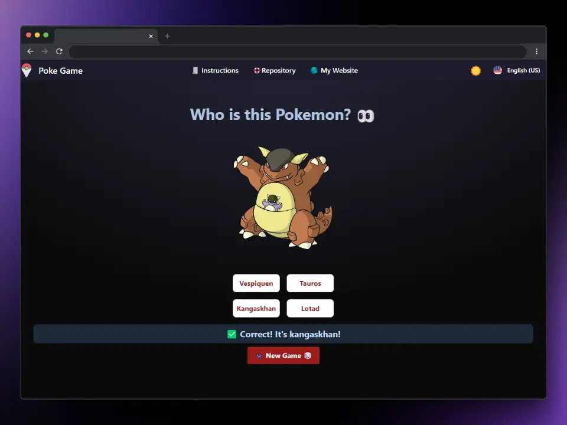

# PokeQuizAdventureGame



## Description

**PokeQuizAdventureGame** is a Pokémon-based quiz game. This project utilizes several modern technologies to create an interactive and dynamic user experience.

## Environment Requirements

Before getting started, make sure you have the following installed on your system:

- [Node.js](https://nodejs.org/en/) (version 16 or higher)
- [pnpm](https://pnpm.io/installation) (package manager)

## Installation

1. **Clone the repository:**

   ```sh
   git clone https://github.com/elvinlab/PokeQuizAdventureGame
   cd pokequizadventuregame
   ```

2. **Install the dependencies:**
   ```sh
   pnpm install
   ```

## Available Scripts

In this project, you can run the following scripts:

- **Development:**

  ```sh
  pnpm dev
  ```

  This command starts the development server using Vite.

- **Build:**

  ```sh
  pnpm build
  ```

## Running Tests

To run tests for this project, use the following command:

```sh
pnpm Test
```

This command builds the project for production.

- **Preview:**
  ```sh
  pnpm preview
  ```
  This command allows you to preview the built project.

## Dependencies

### Production

- **[animate.css](https://animate.style/):** A library of ready-to-use CSS animations.
- **[axios](https://axios-http.com/):** Promise-based HTTP client for the browser and Node.js.
- **[flowbite](https://flowbite.com/):** UI components built with Tailwind CSS.
- **[vue](https://vuejs.org/):** Progressive framework for building user interfaces.
- **[vue-i18n](https://kazupon.github.io/vue-i18n/):** Internationalization plugin for Vue.js.
- **[vue-router](https://router.vuejs.org/):** Official router for Vue.js.

### Development

- **[@vitejs/plugin-vue](https://vitejs.dev/):** Plugin to integrate Vue with Vite.
- **[@vue/test-utils](https://vuejs.github.io/vue-test-utils/):** Utilities for testing Vue components.
- **[@vue/vue3-jest](https://github.com/vuejs/vue-jest):** Jest integration for Vue 3.
- **[autoprefixer](https://github.com/postcss/autoprefixer):** Plugin to parse CSS and add vendor prefixes using values from Can I Use.
- **[babel-jest](https://babeljs.io/docs/en/babel-jest):** Jest transformer for JavaScript ES6+ syntax.
- **[jest-environment-jsdom](https://jestjs.io/docs/configuration#testenvironment-string):** Jest environment that simulates a browser environment using jsdom.
- **[jest](https://jestjs.io/):** JavaScript testing framework.
- **[postcss](https://postcss.org/):** Tool to transform CSS with JavaScript plugins.
- **[tailwindcss](https://tailwindcss.com/):** Utility-first CSS framework for quickly building custom designs.
- **[vite](https://vitejs.dev/):** Fast build tool focused on the frontend.

## Running the Project Locally

1. **Start the development server:**

   ```sh
   pnpm dev
   ```

2. **Open your browser and navigate to:**
   ```
   http://localhost:5173/
   ```

## Contributions

If you would like to contribute to this project, please follow these steps:

1. Fork the repository.
2. Create a branch (`git checkout -b feature/new-feature`).
3. Make your changes and commit them (`git commit -am 'Add new feature'`).
4. Push your changes (`git push origin feature/new-feature`).
5. Open a Pull Request.

---

Thank you for your interest in PokeQuizAdventureGame! If you have any questions or suggestions, feel free to open an issue or send an email.

Have fun playing and learning about Pokémon!
